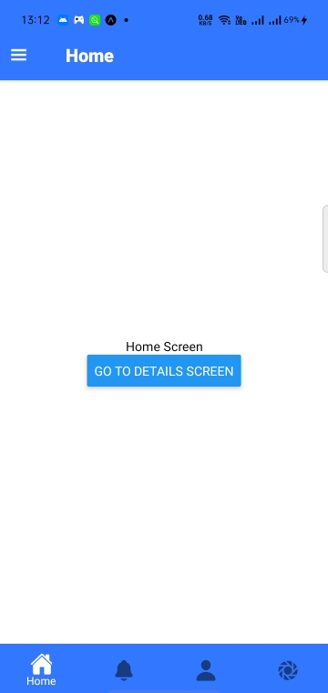
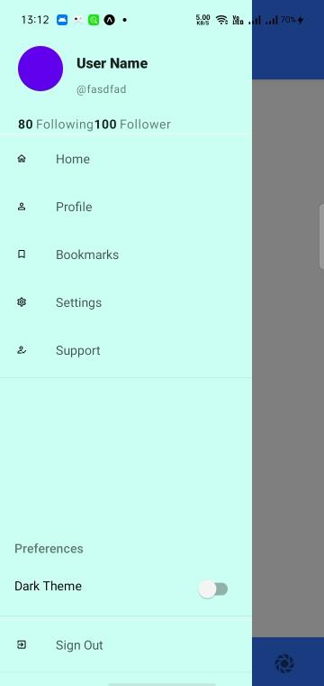
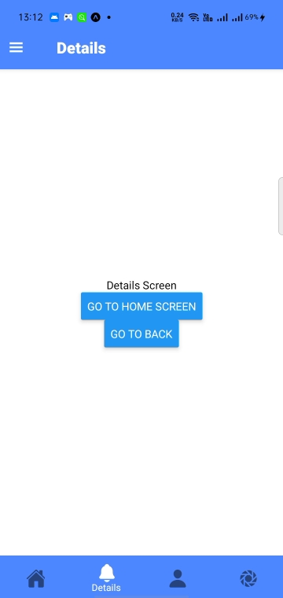
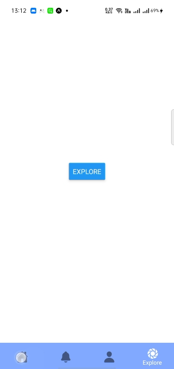

# project_demo_reactnative

Demo Video : https://drive.google.com/file/d/112U1dwFCoGS5Noikr5Jv_o5rhblsitGW/view?usp=sharing

This is demo application made using react native, for the purpose of understanding React Native Components and  React Navigation.
